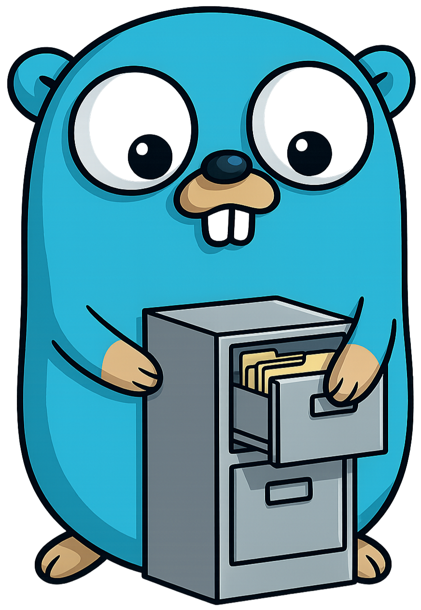

# go-cabinet: Pure Go Microsoft Cabinet File Reader & Writer



[](https://pkg.go.dev/github.com/abemedia/go-cabinet)
[](https://goreportcard.com/report/github.com/abemedia/go-cabinet)
[](https://codecov.io/gh/abemedia/go-cabinet)

A pure Go library for reading, writing, and extracting Microsoft Cabinet (`.cab`) files - commonly used in Windows Update packages, driver distributions, and software installers.

See the [Microsoft Cabinet File Format specification](<https://learn.microsoft.com/en-us/previous-versions/bb417343(v=msdn.10)#microsoft-cabinet-file-format>) for details.

## Installation

```sh
go get github.com/abemedia/go-cabinet
```

## Usage

### Reading / Extracting a Cabinet File

```go
r, err := cabinet.OpenReader("archive.cab")
if err != nil {
  return err
}
defer r.Close()

for _, f := range r.Files {
    rc, err := f.Open()
    if err != nil {
      return err
    }

    out, err := os.Create(f.Name)
    if err != nil {
      return err
    }

    if _, err := io.Copy(out, rc); err != nil {
      return err
    }

    if err := out.Close(); err != nil {
      return err
    }

    if err := rc.Close(); err != nil {
      return err
    }
}
```

The `Reader` also implements `fs.FS`, so it works with `fs.WalkDir`, `fs.ReadFile`, and other standard library functions:

```go
fs.WalkDir(r, ".", func(path string, d fs.DirEntry, err error) error {
    fmt.Println(path)
    return err
})
```

### Writing a Cabinet File

```go
f, err := os.Create("archive.cab")
if err != nil {
  return err
}
defer f.Close()

w := cabinet.NewWriter(f)

wr, err := w.Create("hello.txt")
if err != nil {
  return err
}

if _, err = wr.Write([]byte("hello world")); err != nil {
  return err
}

// Make sure to check the error on Close.
if err := w.Close(); err != nil {
  return err
}
```

If you want to pack any `fs.FS` in one go, use `AddFS`:

```go
if err := w.AddFS(os.DirFS("./my-app-files")); err != nil {
  return err
}
```

You can also add any local file or directory using `AddPath`:

```go
if err := w.AddPath("hello.txt", "./hello.txt"); err != nil {
  return err
}
if err := w.AddPath("", "./my-app-files"); err != nil {
  return err
}
```

See the [package documentation](https://pkg.go.dev/github.com/abemedia/go-cabinet) for further examples.

## Supported Compression Algorithms

- **None** (e.g. uncompressed)
- **MS-Zip** (default)

The LZX and Quantum compression methods are not yet implemented, however custom compressors/decompressors can be registered via `RegisterCompressor` / `RegisterDecompressor`.

## Limitations

- **Single-cabinet only** - multi-cabinet spanning (split archives across multiple `.cab` files) is not supported.
- **Reserved fields** - the reader skips reserved header/folder/data fields and the writer does not produce them (post-processing tools such as `SignTool` add these).
